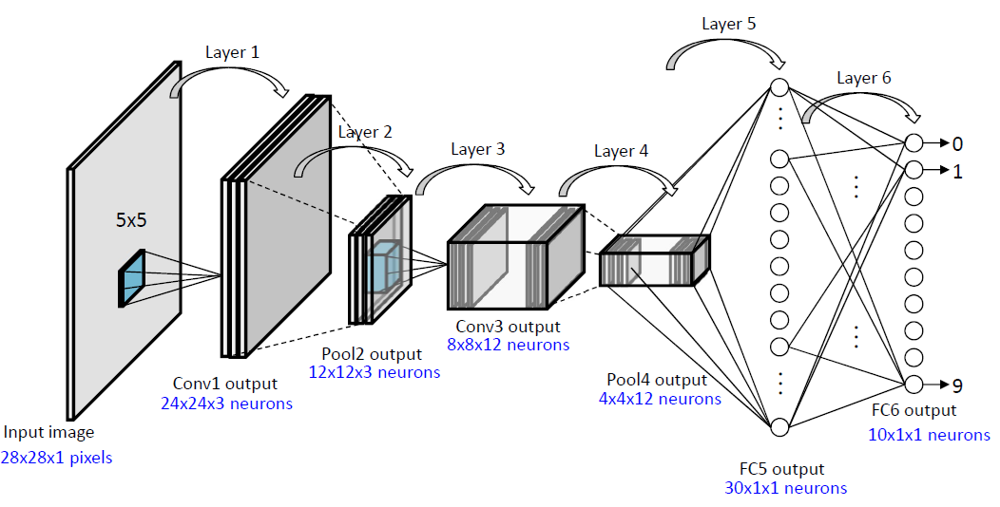
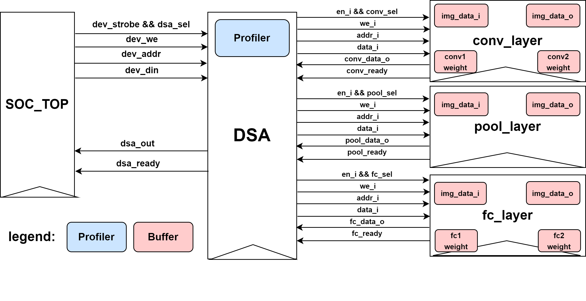
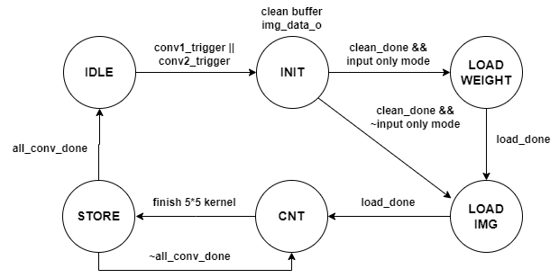
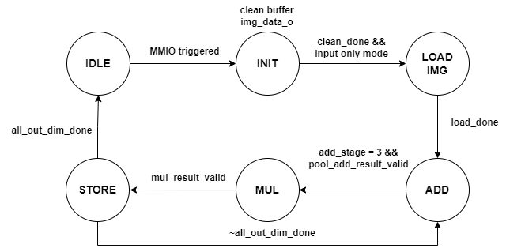
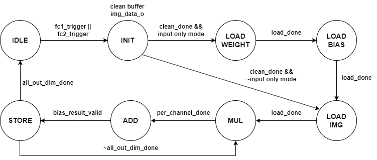

# Domain-Specific Accelerator for CNN Inference on Aquila RISC-V SoC

A hardware–software co-designed Domain-Specific Accelerator (DSA) integrated into the Aquila RISC-V SoC to accelerate CNN-based handwritten digit recognition (MNIST). The accelerator offloads FMA-intensive computation in convolution, pooling, and fully-connected layers via MMIO-controlled hardware modules using Vivado floating-point IP cores, achieving up to **53.96×** overall speedup over the software-only baseline while preserving inference accuracy.

## Table of Contents

- [Overview](#overview)
- [Architecture](#architecture)
- [Repository Structure](#repository-structure)
- [Prerequisites](#prerequisites)
- [Build & Run Workflow](#build--run-workflow)
- [MMIO Address Map](#mmio-address-map)
- [DSA Module Hierarchy](#dsa-module-hierarchy)
- [Performance Results](#performance-results)
- [FPGA Resource Utilization](#fpga-resource-utilization)
- [Key Optimizations](#key-optimizations)
- [Future Work](#future-work)
- [License](#license)
- [Acknowledgements](#acknowledgements)

## Overview

The CNN model is a 6-layer network achieving ~99% accuracy on the MNIST dataset:

<p align="center">
  
</p>

| Layer | Type            | Description                     |
| ----- | --------------- | ------------------------------- |
| 1     | Dummy Head      | Identity input layer (28×28×1)  |
| 2     | Convolutional   | 5×5 kernel, 1→3 channels, ReLU  |
| 3     | Average Pooling | 2×2 pool, 24×24×3 → 12×12×3     |
| 4     | Convolutional   | 5×5 kernel, 3→12 channels, ReLU |
| 5     | Average Pooling | 2×2 pool, 8×8×12 → 4×4×12       |
| 6     | Fully Connected | 192→30, ReLU                    |
| 7     | Fully Connected | 30→10, ReLU (output)            |

Software-only inference on Aquila takes **56,333 ms** for 100 test images. This project integrates a custom DSA that reduces it to **1,044 ms** — a **53.96× speedup**.

## Architecture

```
┌─────────────────────────────────────────────────┐
│                   Aquila SoC                    │
│  ┌────────────┐   MMIO    ┌──────────────────┐  │
│  │  RISC-V    │◄────────►│      DSA Top      │  │
│  │  Core      │           │  (dsa.v)          │  │
│  │ (RV32IMA)  │           │                   │  │
│  └────────────┘           │ ┌──────────────┐  │  │
│                           │ │  conv_layer  │  │  │
│  ┌────────────┐           │ │  (FMA IP)    │  │  │
│  │   UART     │           │ ├──────────────┤  │  │
│  ├────────────┤           │ │  pool_layer  │  │  │
│  │   SPI/SD   │           │ │  (ADD+MUL IP)│  │  │
│  └────────────┘           │ ├──────────────┤  │  │
│                           │ │  fc_layer    │  │  │
│  ┌────────────┐           │ │  (FMA IP)    │  │  │
│  │  DDR3 MIG  │           │ ├──────────────┤  │  │
│  └────────────┘           │ │  Profiler    │  │  │
│                           │ └──────────────┘  │  │
│                           └──────────────────┘  │
└─────────────────────────────────────────────────┘
```

The DSA is accessed via the MMIO address range `0xC400_0000 – 0xC4FF_FFFF` and consists of three dedicated sub-modules, each implementing one layer type with its own FSM and on-chip BRAM buffers.

<p align="center">
  
</p>

## Repository Structure

```
Domain-Specific-Accelerator/
├── hw/                              # Hardware: Vivado project & RTL sources
│   ├── build.tcl                    #   ★ Vivado batch build script (creates project + IPs)
│   └── src/                         #   All source files (referenced in-place by build.tcl)
│       ├── core_rtl/                #   Aquila RISC-V core RTL
│       │   ├── aquila_config.vh     #     Core configuration parameters
│       │   ├── aquila_top.v         #     Top-level Aquila core wrapper
│       │   ├── core_top.v           #     Core pipeline top module
│       │   ├── alu.v                #     ALU
│       │   ├── bcu.v                #     Branch control unit
│       │   ├── bpu.v                #     Branch prediction unit
│       │   ├── csr_file.v           #     CSR register file
│       │   ├── dcache.v             #     Data cache
│       │   ├── icache.v             #     Instruction cache
│       │   ├── decode.v             #     Decode stage
│       │   ├── execute.v            #     Execute stage
│       │   ├── fetch.v              #     Fetch stage
│       │   ├── memory.v             #     Memory stage
│       │   ├── writeback.v          #     Writeback stage
│       │   ├── muldiv.v             #     Multiply/divide unit
│       │   ├── reg_file.v           #     Integer register file
│       │   ├── fp_reg_file.v        #     Floating-point register file
│       │   ├── forwarding_unit.v    #     Data forwarding
│       │   ├── fp_forwarding_unit.v #     FP data forwarding
│       │   ├── pipeline_control.v   #     Pipeline control logic
│       │   ├── program_counter.v    #     Program counter
│       │   ├── clint.v              #     Core-local interruptor
│       │   ├── atomic_unit.v        #     Atomic instruction support
│       │   ├── sram.v               #     Single-port SRAM
│       │   ├── sram_dp.v            #     Dual-port SRAM
│       │   └── distri_ram.v         #     Distributed RAM
│       ├── soc_rtl/                 #   SoC integration & DSA modules
│       │   ├── soc_top.v            #     SoC top-level (Aquila + peripherals) [synthesis]
│       │   ├── soc_tb.v             #     SoC testbench [simulation only]
│       │   ├── dsa.v                #     ★ DSA top module (address decode + profiler)
│       │   ├── conv_layer.v         #     ★ Convolutional layer accelerator
│       │   ├── pool_layer.v         #     ★ Average pooling layer accelerator
│       │   ├── fc_layer.v           #     ★ Fully-connected layer accelerator
│       │   ├── core2axi_if.v        #     Core-to-AXI interface bridge
│       │   ├── mem_arbiter.v        #     Memory arbiter
│       │   ├── memctrl_sim.v        #     Memory controller [simulation only]
│       │   ├── cdc_sync.v           #     Clock-domain crossing sync
│       │   └── uart.v               #     UART controller
│       ├── mem/
│       │   └── uartboot.mem         #     Boot ROM memory initialization file
│       ├── mig/                     #   MIG (Memory Interface Generator) project configs
│       │   ├── mig-arty100t.prj     #     Arty A7-100T DDR3 config
│       │   ├── mig-arty35t.prj      #     Arty A7-35T DDR3 config
│       │   └── mig-qmcore.prj       #     QMCore DDR3 config
│       └── xdc/                     #   FPGA pin/timing constraint files
│           ├── arty.xdc             #     Arty A7 constraints
│           └── qmcore.xdc           #     QMCore constraints
├── sw/                              # Software: CNN inference C application
│   ├── cnn_ocr.c                    #   Main program — CNN evaluation on 100 MNIST images
│   ├── cnn_ocr.ld                   #   Linker script (DDR memory layout)
│   ├── file_read.c                  #   File I/O helpers (read weights/images/labels from SD)
│   ├── file_read.h
│   ├── Makefile                     #   Cross-compilation build (riscv32-unknown-elf-gcc)
│   ├── export-elf.sh                #   Helper script to export .elf for UART boot loading
│   ├── cnn_ocr.objdump              #   Disassembly reference
│   ├── data/                        #   MNIST test data (placed on SD card)
│   │   ├── test-images.dat          #     100 test images
│   │   ├── test-labels.dat          #     Ground-truth labels
│   │   └── weights.dat              #     Pre-trained CNN weights
│   └── inc_cnn/                     #   CNN library headers
│       ├── network.h                #     Network struct & forward propagation
│       ├── layer.h                  #     Layer base interface
│       ├── convolutional_layer.h    #     Conv layer (with DSA MMIO calls)
│       ├── average_pooling_layer.h  #     Pooling layer (with DSA MMIO calls)
│       ├── fully_connected_layer.h  #     FC layer (with DSA MMIO calls)
│       ├── activation_function.h    #     ReLU / identity activation functions
│       ├── config.h                 #     Data type & build configuration
│       ├── dummy_head_layer.h       #     Dummy head (input) layer
│       ├── list.h                   #     Intrusive linked-list utilities
│       └── util.h                   #     Misc utilities
├── picture/                         # Documentation assets
│   ├── model.png                    #   CNN model architecture diagram
│   ├── dsa.drawio.png               #   DSA hardware architecture diagram
│   ├── conv_layer_FSM.drawio.png    #   Convolution layer FSM diagram
│   ├── pool_layer_FSM.drawio.png    #   Pooling layer FSM diagram
│   └── fc_layer_FSM.drawio.png      #   Fully-connected layer FSM diagram
└── README.md
```

## Prerequisites

### Hardware

- **FPGA Board**: Digilent Arty A7-100T (or compatible Arty A7-35T / QMCore)
- **Vivado**: AMD/Xilinx Vivado 2024.1+ (for synthesis, implementation, and FP IP generation)

### Software Toolchain

- **RISC-V GNU Toolchain** (`riscv32-unknown-elf-gcc`) — **GCC version 15.1.0 required**
  - Built for RV32IMA / ILP32
  - Set the `$RISCV` environment variable to point to the toolchain installation
- **Embedded C library** (`elibc`) — a minimal C library for Aquila (located at `../elibc/` relative to `sw/`)
- **GNU Make**
- **Bash** (for `export-elf.sh`)

### Floating-Point IP Cores (Vivado IP Catalog)

The following Vivado FP IPs must be instantiated in the block design or generated via TCL:

| IP                 | Purpose                               | Latency  | Mode         |
| ------------------ | ------------------------------------- | -------- | ------------ |
| Floating-Point FMA | Conv3D dot product & FC dot product   | 2 cycles | Non-blocking |
| Floating-Point ADD | Pooling accumulation (2×2 window sum) | 2 cycles | Non-blocking |
| Floating-Point MUL | Pooling average (÷4 via ×0.25)        | 2 cycles | Non-blocking |

## Build & Run Workflow

### 1. Generate Vivado Project

The hardware project is created entirely from a TCL script (`hw/build.tcl`). This script reads all RTL sources from `hw/src/`, adds constraint and MIG files, and generates the required Vivado IPs (FIFOs, Clock Wizard, SPI, MIG, and **Floating-Point FMA / ADD / MUL**).

```bash
cd hw/

# Launch Vivado in batch mode to create the project
vivado -mode batch -source build.tcl
```

This will:

1. Create a Vivado project `aquila_ap/` targeting the **xc7a100tcsg324-1** (Arty A7-100T).
2. Read all Verilog source files from `src/core_rtl/` and `src/soc_rtl/`.
3. Add `soc_top.v` as the synthesis top module and `soc_tb.v` / `memctrl_sim.v` as simulation-only files.
4. Read `src/mem/uartboot.mem` and `src/xdc/arty.xdc`.
5. Auto-generate all required IPs:
   - Async FIFOs (address, data, signal)
   - Clock Wizard (50 MHz core / 166.67 MHz / 200 MHz)
   - AXI Quad SPI
   - MIG 7 Series DDR3 controller
   - **Floating-Point FMA** (`floating_point_0`) — non-blocking, single-precision
   - **Floating-Point MUL** (`floating_point_mul`) — non-blocking, single-precision
   - **Floating-Point ADD** (`floating_point_add`) — non-blocking, single-precision
6. Open the Vivado GUI with the project ready.

> **Adding custom modules**: If you add new Verilog files (e.g., `src/soc_rtl/my_module.v`), append a `read_verilog` line in `build.tcl` after the existing file list.

### 2. Synthesize & Implement

Inside the Vivado GUI (or via TCL):

```
Run Synthesis → Run Implementation → Generate Bitstream
```

Verify that **WNS ≥ 0** (no timing violations). Using FP IP latency = 1 will cause timing closure failures.

### 3. Build the Software ELF

```bash
# Navigate to the software directory
cd sw/

# Ensure $RISCV points to the riscv32-unknown-elf toolchain (GCC 15.1.0)
export RISCV=/path/to/riscv32-unknown-elf

# Build the CNN inference ELF
make clean && make
```

This produces `cnn_ocr.elf` using:

- **ISA**: `rv32ima_zicsr_zifencei`
- **ABI**: `ilp32`
- **Optimization**: `-O3`

> **Note**: To build with FPU support, edit `sw/Makefile` and swap the `RISCV_ABI` comment lines to use `rv32imad_zicsr_zifencei` / `ilp32d`.

### 4. Load & Run on FPGA

1. Program the FPGA with the generated bitstream.
2. Transfer `cnn_ocr.elf` from WSL subsystem to the desktop
   ```bash
   # Use the export script to copy the ELF for loading
   ./export-elf.sh
   ```
3. Insert SD card into your own computer and place `data/weights.dat`, `data/test-images.dat`, and `data/test-labels.dat` on the SD card.
4. Connect a serial terminal (115200 baud) and reset the board. The program will:
   - Read weights and test data from SD card
   - Run CNN inference on 100 MNIST test images
   - Print accuracy and execution time

## MMIO Address Map

| Device  | Address Range               | Description                 |
| ------- | --------------------------- | --------------------------- |
| UART    | `0xC000_0000 – 0xC0FF_FFFF` | Serial I/O                  |
| SPI     | `0xC200_0000 – 0xC2FF_FFFF` | SD card access              |
| **DSA** | `0xC400_0000 – 0xC4FF_FFFF` | Domain-Specific Accelerator |

### DSA Sub-Address Ranges

| Sub-module           | Address Prefix              | Purpose                          |
| -------------------- | --------------------------- | -------------------------------- |
| Conv Layer — Weights | `0xC410_xxxx`               | Load convolution weights         |
| Conv Layer — Input   | `0xC420_xxxx`               | Load input image                 |
| Conv Layer — Output  | `0xC430_xxxx`               | Read output / trigger init       |
| Conv Layer — Params  | `0xC460_xxxx`               | Set parameters & trigger compute |
| Pooling Layer        | `0xC450_xxxx`               | Buffered average pooling I/O     |
| FC Layer             | `0xC470_xxxx`               | Buffered fully-connected I/O     |
| Profiler             | `0xC400_0030 – 0xC400_0040` | Cycle counter control flags      |

## DSA Module Hierarchy

### `dsa.v` — Top Module

- Address decoding & select signals for sub-modules
- Output multiplexer merging sub-module data outputs
- Hardware profiler (cycle counters gated by MMIO flags)

### `conv_layer.v` — Convolutional Layer Accelerator

**FSM States**: `S_IDLE → S_INIT → S_LOAD_WEIGHT → S_LOAD_IMG_I → S_CNT → S_STORE`

<p align="center">
  
</p>

- Supports two convolution layers (Conv1: 1→3ch, Conv2: 3→12ch) with separate weight buffers
- On-chip BRAM for weights, input image, and output feature map
- Sliding-window index generation in hardware
- FMA IP for 3D dot-product accumulation
- Hardware ReLU: checks sign bit and writes `max(0, x)` directly to output buffer
- Weight preloading: loads weights once, reuses across all 100 inference images

### `pool_layer.v` — Average Pooling Layer Accelerator

**FSM States**: `S_IDLE → S_INIT → S_LOAD_IMG_I → S_ADD → S_MUL → S_STORE`

<p align="center">
  
</p>

- 2×2 window average pooling with dedicated ADD and MUL IPs
- ADD IP accumulates 4 elements, MUL IP multiplies by 0.25
- Fully buffered: loads entire feature map, outputs pooled result

### `fc_layer.v` — Fully-Connected Layer Accelerator

**FSM States**: `S_IDLE → S_INIT → S_LOAD_WEIGHT → S_LOAD_BIAS → S_LOAD_IMG_I → S_MUL → S_ADD → S_STORE`

<p align="center">
  
</p>

- Supports FC1 (192→30) and FC2 (30→10) with separate weight/bias buffers
- Bias-aware initialization for correct forward propagation
- Weight preloading optimization (loads once, skips for subsequent images)
- FMA IP for dot-product computation

## Performance Results

All measurements on 100 MNIST test images. Baseline = software-only (no FPU).

| Region        | Baseline (ms) | Basic (ms)    | Basic Speedup | Advanced (ms) | Advanced Speedup |
| ------------- | ------------- | ------------- | ------------- | ------------- | ---------------- |
| Copy & Pad    | 79.00         | 78.88         | 1.00×         | 75.46         | 1.05×            |
| Conv Compute  | 51,788.08     | 8,919.17      | 5.81×         | 760.24        | **68.12×**       |
| Conv Activate | 646.58        | 649.50        | 1.00×         | 75.52         | 8.60×            |
| Conv Total    | 52,513.65     | 9,647.56      | 5.44×         | 835.77        | 11.54×           |
| FC Total      | 1,007.34      | 1,207.51      | 0.83×         | 81.58         | 14.80×           |
| Pooling Total | 2,812.26      | 1,013.12      | 2.78×         | 126.56        | 8.01×            |
| **Overall**   | **56,333.26** | **11,868.18** | **4.75×**     | **1,043.90**  | **53.96×**       |

## FPGA Resource Utilization

Target: Arty A7-100T

| Resource     | Aquila Max | Baseline | Advanced DSA |
| ------------ | ---------- | -------- | ------------ |
| LUTs         | 63,400     | 7.28%    | 55.48%       |
| LUT (logic)  | 63,400     | 7.14%    | 34.88%       |
| LUT (memory) | 19,000     | 0.45%    | **68.73%**   |
| D Flip-Flops | 126,800    | 3.07%    | 18.93%       |
| BRAM         | 135        | 12.59%   | **33.70%**   |
| DSP          | 240        | 1.67%    | **12.50%**   |

The increase in LUT-memory and BRAM is primarily due to on-chip buffering of CNN weights and feature maps. DSP usage grows from 4 to 30 units due to the floating-point IP cores.

## Key Optimizations

1. **Buffered Data Flow** — Entire input images and weights are loaded into on-chip BRAM before computation begins. The hardware FSM handles sliding-window traversal and FMA accumulation internally, eliminating per-element MMIO overhead.

2. **Weight Preloading** — Neural network weights are loaded only once during the first image inference. A `weight_preloaded` flag allows subsequent images (99 of 100) to skip weight loading entirely, reducing MMIO transactions from 576,000 to 5,760 for the FC layer alone.

3. **Hardware ReLU** — Activation is computed in hardware by checking the IEEE 754 sign bit (`result[31]`). The activated output is written directly to the output buffer, eliminating a separate software copy pass.

4. **FP IP Latency Tuning** — All floating-point IPs are configured with **latency = 2 cycles** (non-blocking), reduced from the default 17 cycles, significantly improving FMA pipeline throughput.

5. **Dedicated Pooling IPs** — Average pooling uses separate ADD and MUL IPs instead of sharing the FMA unit, allowing the pooling layer to operate independently.

## Future Work

- **Parameterized Kernel/Stride** — Currently hardcoded to 5×5 kernels with stride 1. Making these configurable would enable reuse on other CNN architectures.
- **Parallel FMA Units** — Instantiating multiple FMA cores to process several multiply-accumulate operations simultaneously, potentially doubling throughput within remaining resource headroom.
- **Layer Fusion** — Combining adjacent layer computations (e.g., Conv → Pool) into a single hardware invocation to reduce inter-layer MMIO overhead, which may become significant in deeper networks.

## License

The Aquila RISC-V core and SoC infrastructure are released under the **BSD-3-Clause License** by the Embedded Intelligent Systems Lab (EISL), Department of Computer Science, National Yang Ming Chiao Tung University (NYCU), Hsinchu, Taiwan.

## Acknowledgements

- **Aquila RISC-V SoC** — Designed by Prof. Chun-Jen Tsai and the EISL lab at NYCU
- **CNN Library** — Developed by Chang-Chun Liao
- **Course** — Microprocessor Systems: Principles and Implementation, Dept. of CS, NYCU
